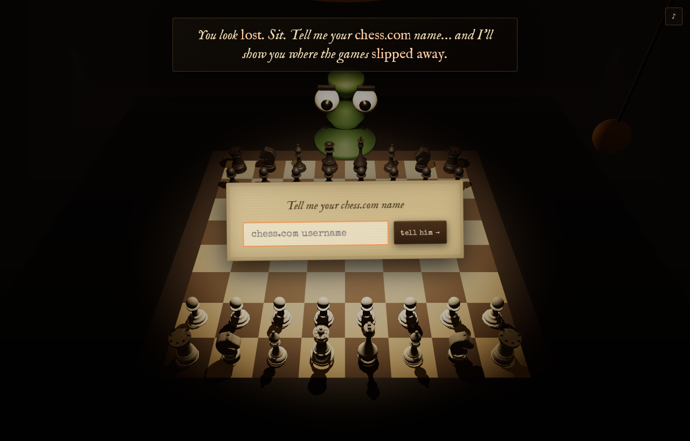
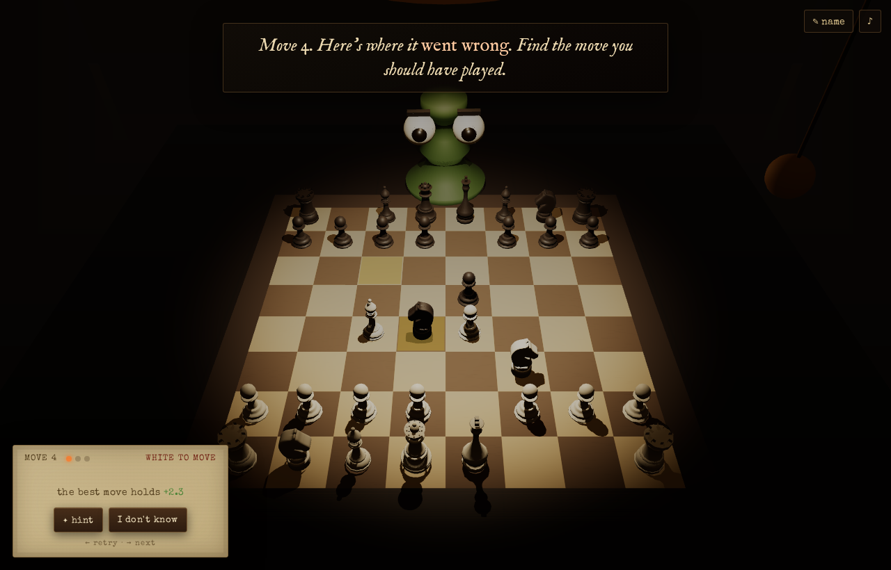

# ♟ Revise My Chess — *the cabin*

You wake at a table in a dark wooden cabin, lit by guttering candles. Across
the table sits a giant pawn with two big eyes. He asks for your **chess.com**
name, slides a sheet of parchment listing your recent losses, and then makes
you replay the exact moments you threw each game away — on a real **3D board**,
with **Stockfish** judging every move.

A WebGL homage to *Inscryption*'s Act 1, built on a chess blunder-trainer.



## How it works

1. **It opens at the table** — no menu. The board is already set, candles lit.
2. **The host asks your chess.com name.** Your recent losses are fetched from
   the public chess.com API (no login or key). He slides a parchment of games.
3. **Touch a game.** Stockfish (WebAssembly, in a Web Worker — nothing leaves
   your machine) reads it and finds where it went wrong.
4. **Replay your blunders on the 3D board.** For each critical moment the board
   rewinds, the host's last move replays, and he asks you to find the move you
   *should* have played:
   - **Best move** (≤0.25 pawns from optimal) → he's pleased; click **Next** (→).
   - **Great** (≤0.8) → praised, but you can retry for the stronger move, or keep it.
   - **Inaccurate** (≤1.6) → it slips; try again.
   - **Worse** → the board resets; try again. You always get to retry.
   - **✦ hint** highlights the piece; **I don't know** reveals the answer.
   - **←** retries the position (even after solving — without re-scoring); **→** advances.
5. **The verdict** — a parchment of your stats and a rank, from *Blunder
   Apprentice* to *Silicon Grandmaster*.



## Running it

A fully static site (a server is required for the Stockfish worker and ES
modules — opening the file directly won't work):

```bash
python serve.py            # or: npx http-server -p 8080
# then open http://127.0.0.1:8080
```

`serve.py` sends correct MIME types (Windows' `http.server` mislabels `.js`/
`.wasm`, which breaks the modules) and no-cache headers so a refresh always
picks up fresh code. Deep link: `?user=yourname` pre-fills the name.

## Tech

- **No build step, no framework, no backend.** Vanilla ES modules + WebGL.
- `lib/three/` — Three.js r184 (core ESM) + the GLTFLoader addon, used to
  build the scene (candlelit cabin, table, the pawn host, parchment) and to
  load the chess pieces.
- `assets/models/*.glb` — the chess piece models, loaded with GLTFLoader and
  painted ivory/dark at runtime. Source: github.com/ordamari/3d-chess (see
  `assets/models/SOURCE.txt`; the upstream repo has no explicit license, so
  treat these as placeholder art and swap if you need a specific license).
- `lib/stockfish.*` — Stockfish 10 (WASM, asm.js fallback) in a Web Worker.
- `lib/chess.js` — move generation / PGN parsing.
- `assets/fonts/` — self-hosted *IM Fell English* (old serif) + *Special Elite*
  (typewriter) for the cabin's UI.

### Module map

```
js/app.js     flow state machine (BOOT→ASK_USERNAME→FETCHING→PICK_GAME→
              ANALYZING→QUIZ→SUMMARY); judging/scoring; window.__rmc test hook
js/scene.js   renderer, camera, room, table, candle lights + flicker, vignette
js/board3d.js the 3D board: square↔world map, raycast input, move/highlight anim
js/pieces.js  procedural pieces (LatheGeometry profiles + primitive decor)
js/host.js    the pawn host: bob, blink, gaze, lean, reactions
js/paper.js   the parchment: game list / verdict, slide-in, raycast row-pick
js/ui.js      thin HTML overlays: speech, float labels, sparkles, promotion
js/tween.js   promise-based rAF tweens (FAST flag for deterministic tests)
js/chesscom.js / engine.js / analysis.js / sound.js   unchanged engine code
```

The pieces and board live entirely in WebGL (no DOM squares), so the automated
test drives the app through a small `window.__rmc` hook (submitUsername,
pickGame, playMove, squareToClient, reveal, next…), with one real raycast
click to verify pointer→square mapping under the 3D camera.

## Tests

```bash
node test/smoke.mjs   # analysis pipeline against real Stockfish (Node)
node test/e2e.mjs     # full cabin flow in headless WebGL via Playwright
```
