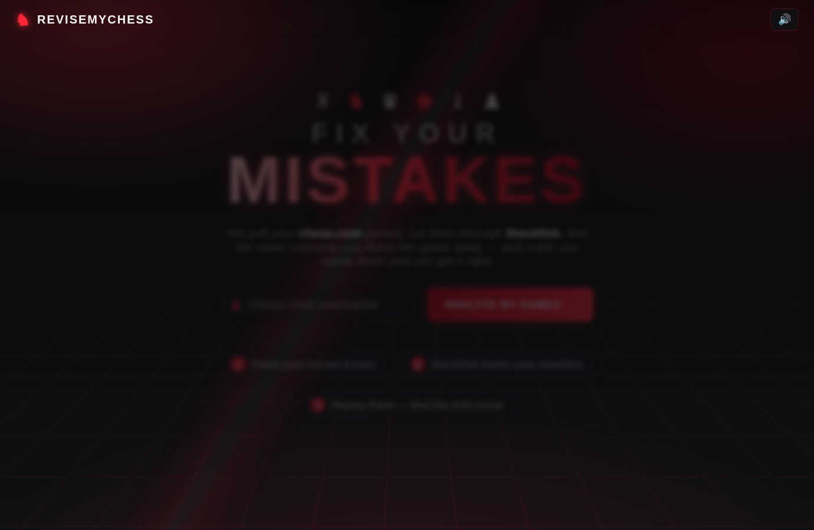

# ♞ ReviseMyChess — Fix Your Mistakes

A chess trainer that pulls your **chess.com** games, runs every
position through **Stockfish**, finds the exact moments you threw the game
away — and makes you replay them until you find the move you *should* have
played.



## How it works

1. **Enter your chess.com username.** Your recent losses are fetched from the
   public chess.com API (no login or API key needed).
2. **Pick a game to dissect.** Stockfish (WebAssembly, running entirely in
   your browser — nothing is uploaded anywhere) evaluates every position
   while a pawn bounces through its promotion forms.
3. **Replay your critical moments.** For each blunder, the board rewinds to
   just before your mistake, replays your opponent's last move, shows you the
   eval the best move would hold, and asks you to find it:
   - **Best move** → gold/green particle burst; click **Next** (or press →)
     when you're ready to move on.
   - **Great move** (within ~0.8 pawns of best) → gold burst and praise, but
     you can retry to find the even-stronger move (or keep it and move on).
   - **Reasonable move** (within ~1.6 pawns) → orange burst — it doesn't lose,
     but it lets the advantage slip. Try again.
   - **Anything worse** → red burst, board shakes and resets — try again.
     You always get to retry until you find the best move.
   - **🤷 I don't know** → Stockfish shows the answer.
   - **💡 Hint** → highlights the piece that wants to move.
   - **Keyboard:** ← resets the position for another try, → advances when
     Next is available.
4. **Session summary** — first-try solves, retries, reveals, and a rank from
   *Blunder Apprentice* to *Silicon Grandmaster*. Confetti included.

## Running it

It's a fully static site — any web server works (a server is required for the
Stockfish worker; opening `index.html` directly from disk won't):

```bash
python serve.py                # or: npx http-server -p 8080
# then open http://127.0.0.1:8080
```

Prefer `serve.py` over `python -m http.server`: it guarantees correct MIME
types (Windows' http.server often serves .css/.js as text/plain, which makes
Chrome render the page unstyled and refuse to run the ES modules) and sends
no-cache headers so a plain refresh always picks up fresh code.

Deep link: `http://localhost:8080/?user=yourname` pre-fills your username.

## Tech

- **No build step, no framework, no backend.** Vanilla ES modules.
- `lib/stockfish.js` + `lib/stockfish.wasm` — Stockfish 10 (WASM) run in a
  Web Worker, with `lib/stockfish.asm.js` as a pure-JS fallback (GPLv3,
  see `lib/stockfish.LICENSE`).
- `lib/chess.js` — move generation / PGN parsing (BSD-2-Clause,
  see `lib/chess.js.LICENSE`).
- Interactive board (click-to-move + drag & drop, promotion picker,
  legal-move dots, check highlights) built from scratch in `js/board.js`.
- Particle bursts, screen sweeps and confetti via the Web Animations API
  (`js/effects.js`); sound effects synthesized with WebAudio (`js/sound.js`)
  — zero media assets.

### Blunder detection

Every position (after the opening) is evaluated at depth 12. A move of yours
is a *critical moment* when it drops ≥ 1.3 pawns of evaluation (≥ 2.5 =
blunder), unless the position was already hopeless. The top 8 moments,
in game order, become your quiz. Your quiz answers are judged live at
depth 13 against the engine's best line.

## Tests

```bash
node test/smoke.mjs   # analysis pipeline against real Stockfish (Node)
node test/e2e.mjs     # full browser flow via Playwright (mocked chess.com API)
```
